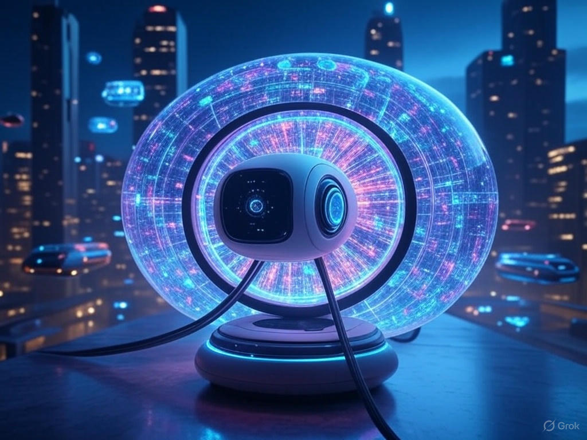
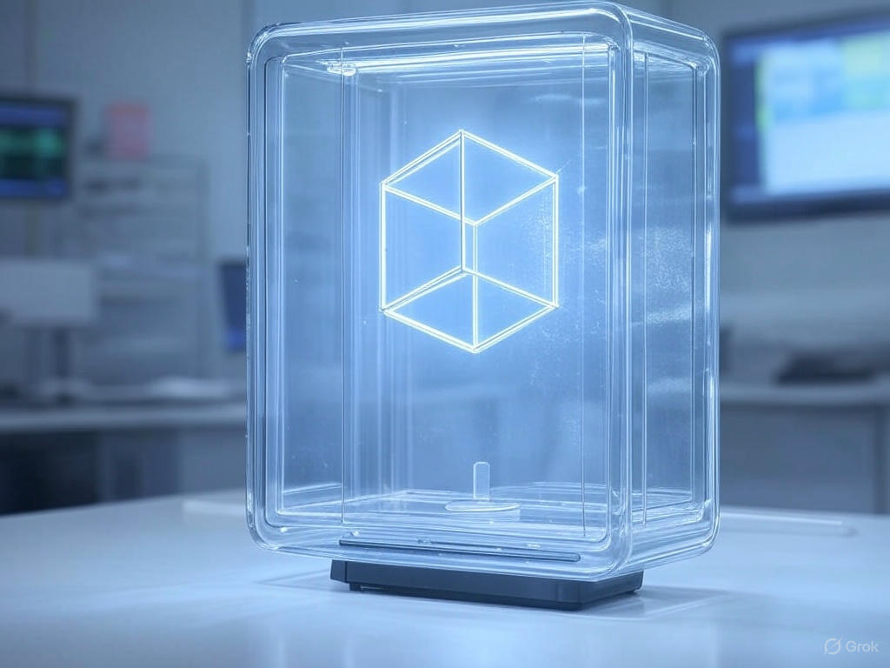

# ⚡️ Eletria

### "Photon Emission by Controlled Electron-Ion Interaction in a Volumetric Grid"

### See [NOTE.md](NOTE.md)

**Eletria** is a conceptual system for generating volumetric (3D) images — not through screens or projections, but by emitting photons directly into space. It uses *beam pairs* of electrons that intersect precisely inside an ionized medium to activate **lit voxels** — visible points of light suspended in mid-air.

<p float="center">
  
  
  
</p>

> Imagine a real-time 3D display where each pixel is a floating point of light, activated by physics itself.

---

## Core Concept

At the heart of Eletria is a **controlled recombination event**:

- A **vacuum-sealed or low-pressure chamber** is filled with a lightly ionized gas (e.g., hydrogen, helium, neon).
- **Electron beam pairs** are directed to intersect at precise spatial coordinates — the logical voxel nodes.
- Where the beams intersect and meet ion density thresholds, **visible photons** are emitted via **electron-ion recombination**.
- The result: a sharp, localized point of light — a **voxel** — visible without any screens or lenses.

---

## Key System Components

### 1. Voxel Grid (Logical Node Space)
- A 3D coordinate system where voxels are defined in software.
- Physically, the space is empty — only the beam engine determines where a voxel lights up.

### 2. Ionized Medium
- Lightly ionized noble or diatomic gases (H₂, He, Ne) optimized for safe, visible photon emission.
- Maintained at controlled pressure and temperature for optimal performance.

### 3. Beam Pairs (xN)
- Each **Beam Pair** consists of two electron beams aimed to intersect at a specific voxel.
- Electron beams are steered by electromagnetic or electrostatic gimbals (quaternion-driven).
- Multiple pairs enable **parallel voxel activation** and higher image resolution.

### 4. SpinStep Engine [🔗 GitHub →](https://github.com/VoxLeone/SpinStep)
- Controls the traversal of the voxel grid.
- Computes and drives emitter trajectories in real-time.
- Coordinates timing, firing, and beam steering logic.

### 5. Laser Clearing System (Optional, Advanced)
- **Infrared pre-pulses** clear ions along the beam path just before each electron pulse.
- Prevents premature photon emission and improves voxel sharpness.

### 6. Sensor & Feedback Subsystem (Future Work)
- Visual or particle-based sensors monitor voxel accuracy.
- Feedback loops dynamically adjust emitter calibration, beam power, or gas conditions.

---

## System Workflow

```text
1. Initialize
   • SpinStep maps target voxel coordinates in the logical 3D grid.

2. Beam Path Calculation
   • For each voxel, SpinStep computes the trajectory of a Beam Pair.

3. IR Pulse (optional)
   • A laser pre-clears the beam path to suppress unintended interactions.

4. Beam Firing
   • Two electron pulses are emitted to intersect at the target voxel.

5. Photon Emission
   • Local electron-ion recombination emits a visible photon → voxel lit.

6. Frame Completion
   • Repeat across all voxel targets for each frame refresh cycle.
````

---

## Why Use Beam Pairs?

Single electron beams can't localize energy precisely in 3D space. Instead, **Beam Pairs**:

* Only produce recombination events at their point of intersection.
* Enable **logical AND-style targeting**: high spatial and energy specificity.
* Scale naturally: N pairs → N parallel voxels → better performance.

---

## ⚠️ Engineering Considerations

| Challenge       | Approach                                       |
| --------------- | ---------------------------------------------- |
| Beam Precision  | Quaternion-based steering, feedback loops      |
| Ion Management  | Gas mix tuning, optional IR laser clearing     |
| Synchronization | Real-time coordination via SpinStep            |
| Safety          | Beam shielding, vacuum safety, interlocks      |
| Refresh Rate    | Multithreaded beam pair control & multiplexing |

---

## Explore the Project

### * [Read the docs](docs/)

> *For full documentation, see the `docs/` directory.*

---

## Status

**Prototype phase.** Core ideas under development.
Currently designing:

* [Beam steering and control protocols](https://github.com/VoxleOne/SpinStep/)
* Gas chamber specs
* Timing & triggering logic
* Documentation and modeling support

Contributions, discussion, and simulation models are welcome!

---

## 📜 License

MIT License © [VoxleOne](https://github.com/VoxleOne)

---
